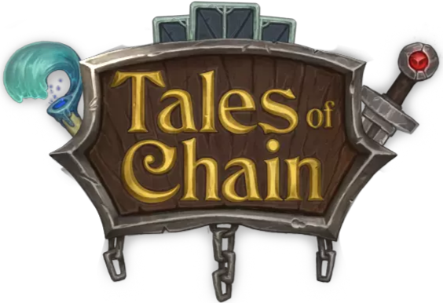

# **Tales Of Chain** | contracts
<p align="center">
  
</p>
Smart contracts for Tales Of Chain:

* Vesting TALE token
* 3 types of staking
* Tale heroes based on NFT
* Minter factory
* Tale rental contract

# TALE vesting token
https://bscscan.com/token/0x9755ac467BEE2E7558B89988Df3dE4cA4f16b123
# Staking
* Flexible Staking
https://bscscan.com/address/0xA033cb843E56D4eadefd5E11f5d68299455ee412
* Challenge Staking https://bscscan.com/address/0x705AAF6c3472eaeA1bCa3f7A472A7a9a7e3147EF
* NFT Staking
  - Uncommon https://bscscan.com/address/0xd47Bd6487dcDae8d8877d61376C7187b223D1888
  - Rare https://bscscan.com/address/0xdFC8eEF605E060C18F9903484a0589aA365a9962
  - Epic https://bscscan.com/address/0xbB42A7CBde75b758642Cd0659DD6369319B0FaC4
  - Legendary https://bscscan.com/address/0x119e667868e253cA75dCfcE4d1a99B56dBc9C17D
# TALE heroes
The Hero of Tales Of Chain is BEP-721 tokens. Each hero is represented by their own smart contract.

Cards for Challenge Staking:
* Uncommon card https://bscscan.com/address/0x33CF249244A234A975c1cFF2E0cb7BA6924F79BE
* Rare card https://bscscan.com/address/0x68bed9e18941C48b26E8142f0f53258F47BaFCCC
* Epic card https://bscscan.com/address/0x754E487D7235CadE40430d84F5f02054Fd6E78e8
* Legendary card https://bscscan.com/address/0x18642cb173203956390dEadB8E261e4ceFbF41A9

Cards:
* Talouriel Gilven https://bscscan.com/address/0xF9979d6bb0542e746E0bD023B80757479a4c13FD

# Minter factory
https://bscscan.com/address/0x22172f3f000e17ee7abf488b0cdb1ab18604557d
# Tale rental
https://bscscan.com/address/0x7c7A01308f94aaD6cB681A8E65a061d91C8E29be
# Marketplace
https://bscscan.com/address/0x110E3a1563493384e02bF1fEc2F7Ff2Be2Fb40Db
# Card packs
https://bscscan.com/address/0xCc35B201F1348310160962202EdfeA472486e239
# Tests
To run the tests, install the dependencies:
```console
$ npm install
```
And run the tests:
```console
$ truffle test
```
# Audit
TALE token successfully passed the audit in [Armors Labs](https://armors.io/) under number ``0X202112310026``
# License
Tales Of Chain Contracts is released under the [MIT License](LICENSE).